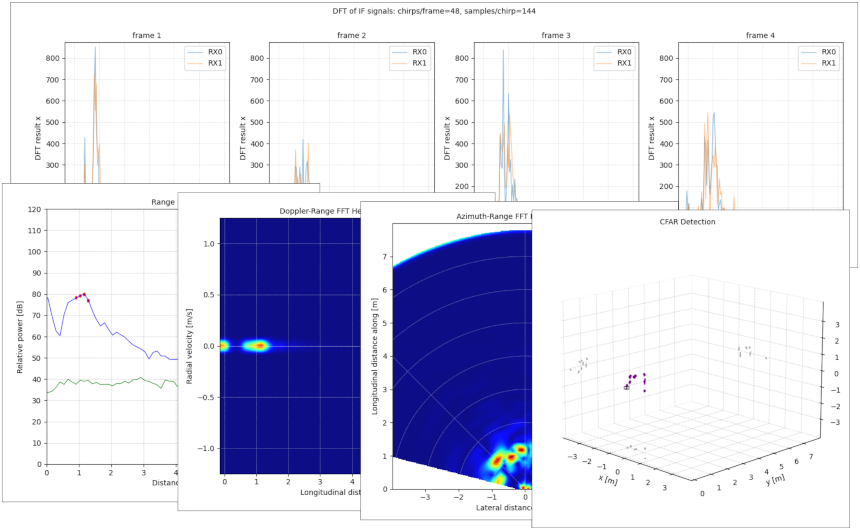

# Pythonic mmWave Toolbox for TI's IWR Radar Sensors

## Introduction

This is a toolbox composed of Python scripts to interact with TI's evaluation module (BoosterPack) for the IWR1443 mmWave sensing device. The toolbox provides easy access to particular OOB firmware versions, which are included in TI's mmWave SDKs and Industrial Toolboxes while focusing on data capturing and visualization with Python 3. Some elements of the toolbox can be considered being a Pythonic alternative to TI's mmWave Demo Visualizer.



## Support 

* IWR1443 ES2.0
  * Capture Demo (SDK 1.1.0.2)
  * mmWave SDK Demo (SDK 1.2.0.5)
  * High Accuracy 14xx (Industrial Toolbox 2.5.2)
  * 4K FFT Stitching (Industrial Toolbox 2.5.2)
* IWR1443 ES3.0
  * mmWave SDK Demo (SDK 2.1.0.4)
  * High Accuracy 14xx (Industrial Toolbox 4.1.0)
* IWR1843 ES1.0
  * mmWave SDK Demo (SDK 3.4.0.3)
* IWR6843 ES2.0
  * mmWave SDK Demo (SDK 3.4.0.3)

> Advanced frame configuration with subframes is yet not supported.

## Features

* 2D plots
  * range and noise profile
  * Doppler-range FFT heat map
  * azimuth-range FFT heat map
  * FFT of IF signals
* 3D plots
  * CFAR detected objects (point cloud)
  * simple CFAR clustering
* Data capture
  * range and noise profile with CFAR detected objects

> 3D plots are currently not implemented for IWR1843 ES1.0 and IWR6843 ES2.0.

## Usage

The launcher of the toolbox is `pymmw.py`:

```
usage: pymmw.py [-h] [-c CONTROL_PORT] [-d DATA_PORT]
arguments:
  -h, --help                                        show this help message and exit
  -c CONTROL_PORT, --control-port CONTROL_PORT      serial port for control communication
  -d DATA_PORT, --data-port DATA_PORT               serial port for data communication
```

In GNU/Linux, the launcher attempts to find and select serial ports of a valid USB device if no serial ports are provided.

## Internals

1. The launcher
   - performs a connection test and resets the device (via the XDS110 debug probe).
   - observes the control port and tries to detect the firmware by its welcome message.
   - dynamically imports and initializes the handler (from `/mss/*.py`) for the firmware.
2. The handler
   - reads its configuration file (from `/mss/*.cfg`) once at startup.
   - observes the data port and starts applications (from `/app/*.py`) defined in `_meta_` with their required arguments.
   - captures data from the data port, possibly performs data preprocessing, and pipes the data to the application processes.
3. Each application process
   - takes the data from stdin.
   - performs postprocessing, mostly for visualization or capturing purposes.
   - puts data, if implemented, to a file in `/log`.

> Be patient when using Capture Demo for the "FFT of IF signals" application as the ADC data is first copied from ADC buffers to L3 memory and then published via UART. The update interval is about 10 seconds.

## Configuration

The configuration files are pretty much like the original TI's profiles, except that they are JSON-formatted. Furthermore, all entries without a value (set to null) are attempted to be filled up with inferred values from the additional `_settings_` block, which contains advanced settings for postprocessing (like range bias due to delays in the RF frontend) and a generic antenna configuration.

> Make sure to have an appropriate configuration file with reasonable settings related to the firmware and handler, respectively, residing in `/mss`. Several configuration files with exemplary settings for different profiles and use cases are stored in `/mss/cfg`.

## Dependencies

The toolbox works at least under GNU/Linux and Windows 10 with Python 3.8.5 if the following dependencies are met:

* pyserial (3.4)
* pyusb (1.0.2)
* matplotlib (3.3.1)
* numpy (1.19.1)
* scipy (1.5.2) - is only required for the application "azimuth-range FFT heat map" of the mmWave SDK Demo
* tiflash (1.2.9) - is only required for the application "FFT of IF signals" of the Capture Demo in conjunction with Texas Instruments’s Code Composer Studio (8.3.0) scripting interface to read ADC data from the L3 memory
* pyftdi (0.51.2) - is only required for the tool "reset via FTDI"
* XDS Emulation Software Package (8.3.0) - is only required for working with Windows

> To make the tiflash module and the "FFT of IF signals" application work properly, an environment variable named CCS_PATH should point to the Code Composer Studio directory.

## Reference

If you find this toolbox or code useful, please consider citing our [paper](https://publikationsserver.tu-braunschweig.de/receive/dbbs_mods_00066760):

```
@inproceedings{constapel2019practical,
  title={A Practical Toolbox for Getting Started with mmWave FMCW Radar Sensors},
  author={Constapel, Manfred and Cimdins, Marco and Hellbr{\"u}ck, Horst},
  booktitle={Proceedings of the 4th KuVS/GI Expert Talk on Localization},
  year={2019}
}
```
